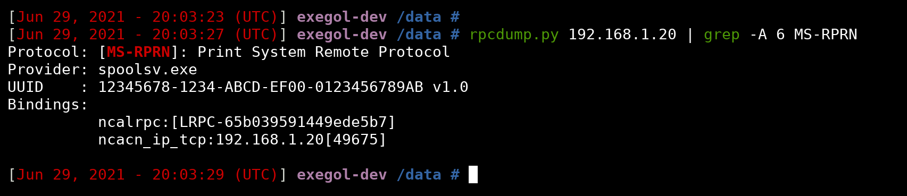

# Prioritising IPv4 over IPv6

**Table of contents**

 + [Introduction](./#Introduction)
 + [Setup on a local machine](./local-machine.md)
 + [Setup on a group of machines in the domain](./on-a-group-of-machines-in-the-domain.md)

---

## Introduction

The Microsoft Windows operating system Print Spooler is a service for managing print jobs. The executable for this service is `spoolsv.exe` and this service is **enabled by default** on most Microsoft Windows systems.

It has been impacted by a large number of vulnerabilities over the years, and was used as the spread vector of the virus [Stuxnet](http://virus.wikidot.com/stuxnet).

Recently, two new critical vulnerabilities were released. The [CVE-2021-1675](https://msrc.microsoft.com/update-guide/vulnerability/CVE-2021-1675) (also called PrintNightmare) and the [CVE-2021-34527](https://msrc.microsoft.com/update-guide/vulnerability/CVE-2021-34527).

In order to fix these vulnerabilities, it is generally recommended to disable the print spooler service on Windows servers that do not require it. In the following sections, we will see 3 methods to disable this service.


During the recognition phase of a pentest or simply when attacking the internal network of a company, the attackers carry out scans of the machines. These scans make it possible to detect the services and their versions that are running on the machines of the network. The print spooler service being an RPC service, an attacker can check if it is active with the following `rpcdump.py` command:

```
# rpcdump.py 192.168.1.21 | grep MS-RPRN -A6
```

If the service is active, it will be displayed in the list of RPC services and will be found by the `grep MS-RPRN -A6`:



---


## References
 - https://docs.microsoft.com/en-us/troubleshoot/windows-server/networking/configure-ipv6-in-windows
