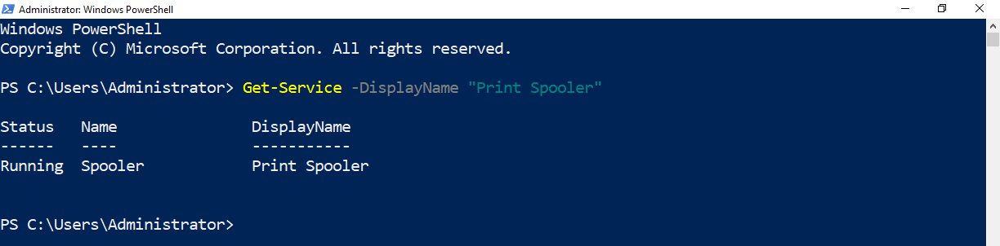
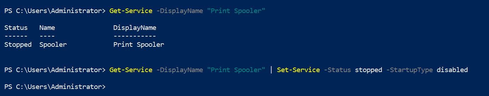

# Setup on a local machine

## Checking that the Print Spooler service is active

## Configuration

Select the "_Print Spooler_" with [Get-Service](https://docs.microsoft.com/en-us/powershell/module/microsoft.powershell.management/get-service?view=powershell-7.2) and use [Set-Service](https://docs.microsoft.com/en-us/powershell/module/microsoft.powershell.management/set-service?view=powershell-7.2) to stop the service and disable it at startup.

## Reverting this change

## References
 - https://docs.microsoft.com/en-us/powershell/module/microsoft.powershell.management/get-service?view=powershell-7.2
 - https://docs.microsoft.com/en-us/powershell/module/microsoft.powershell.management/set-service?view=powershell-7.2