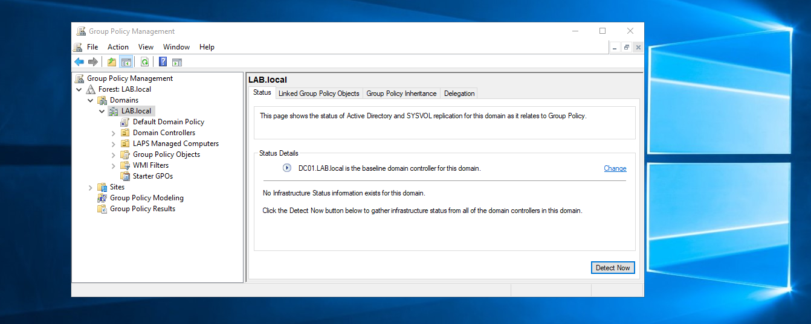

# Setup on a group of machines in the domain

To disable the print spooler on a group of machines in the domain, we need to create a Group Policy that will disable this service by default on the machines. The change will take effect at reboot of the machines.

## Configuration

First, we need to login to the domain controller with a domain administrator. And then we run the Group Policy Management console (`mmc.exe`):

## Reverting this change

## References
 - https://docs.microsoft.com/en-us/troubleshoot/windows-server/networking/configure-ipv6-in-windows