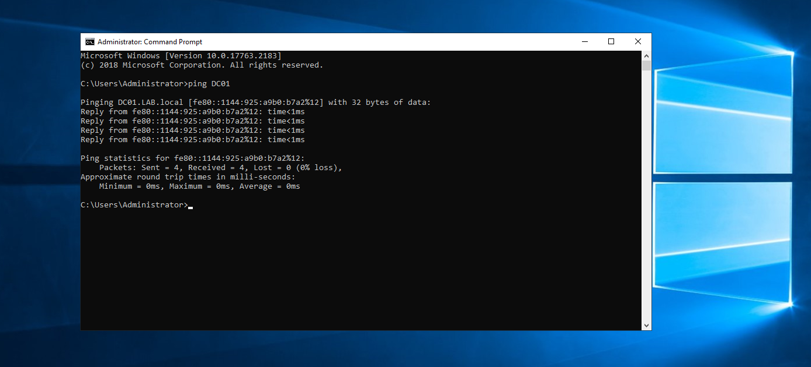
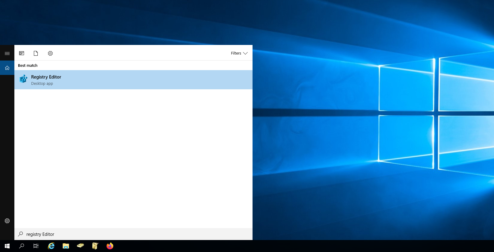
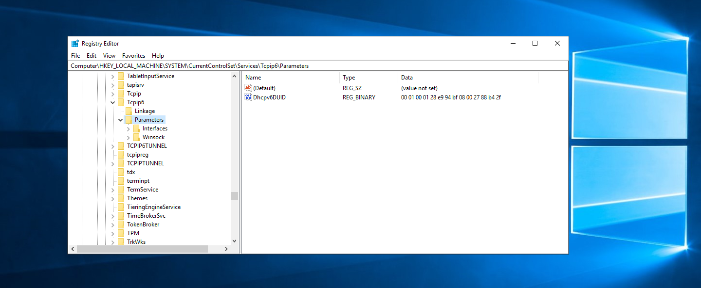

# Setup on a local machine

## Checking that IPv6 has priority

To check that this machine has IPv6 used in priority over IPv4, ping the machine name:

If you have an address starting with `fe80` this means your machine replies with IPv6.

## Reverting this change

To prioritise IPv4 over IPv6 on a local Windows machine, we need to add a registry entry and reboot for the change to take effect.

First, we need to login to the computer with a local or domain administrator. And then we run the registry editor (`regedt32.exe`):

Next, we access the `HKLM\SYSTEM\CurrentControlSet\Services\Tcpip6\Parameters` location in the registry by typing it in the path to the key in the top bar of the window or by searching it in the directory tree on the left:

Then we add a `DWORD (32-bit) Value` registry key here:

And we set the value `0x32` (20 in decimal) allowing to "Prefer IPv4 over IPv6" (reference: [https://docs.microsoft.com/en-us/troubleshoot/windows-server/networking/configure-ipv6-in-windows](https://docs.microsoft.com/en-us/troubleshoot/windows-server/networking/configure-ipv6-in-windows))

Summary of the registry entry we created:

|   |   |
|---|---|
| **Location** | `HKLM\SYSTEM\CurrentControlSet\Services\Tcpip6\Parameters` | 
| **Key**      | `DisabledComponents`                                       | 
| **Type**     | `REG_DWORD`                                                | 
| **Value**    | `0x20`                                                     | 

Now we reboot the machine and this parameter is now applied. 

## Reverting this change

To undo this change, simply delete the registry entry, then reboot again.

## References
 - https://docs.microsoft.com/en-us/troubleshoot/windows-server/networking/configure-ipv6-in-windows